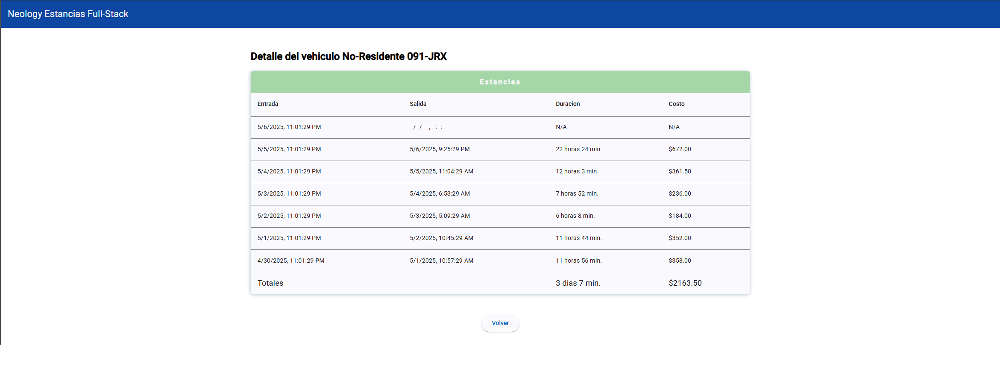

# Capturas del funcionamiento de la applicación

Listado paginado inicial de vehiculos

Listado ordenado por placas con diferente numero de resultados por pagina

Agregar vehiculo oficial

Registrar entrada a la estancia (Solo cuando no esta en estancia)

Estancia agregada y cambia la estancia

Registrar salida de la estancia (Solo cuando si esta en estancia)

Estancia completa y cambia la estancia

Estancia agregada a la vista de detalle

Vista detallada vehiculo oficial

Vista detallada vehiculo residente

Vista detallada vehiculo no-residente

Log de pagos de vehiculo residente

Reiniciar tracking del mes

Lista de vehiculos despues del reinicio

Detalle del vehiculo despues del reinicio
